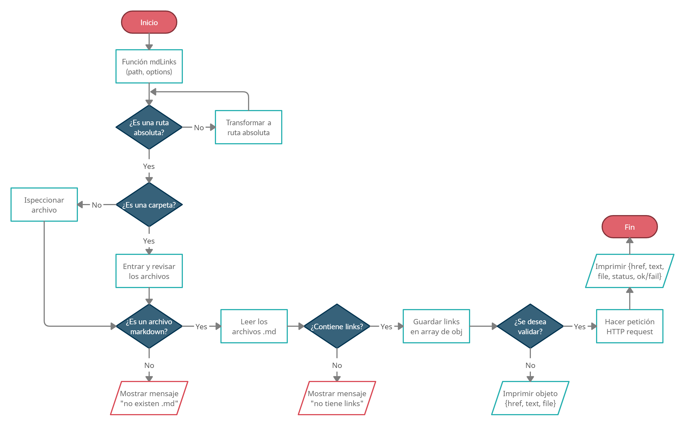
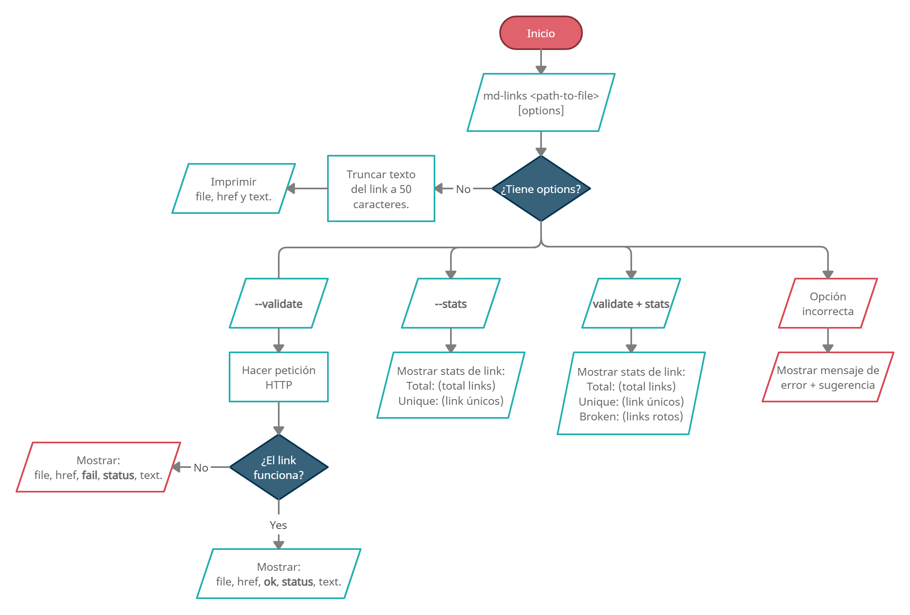

# Markdown Links

## Índice

- [1. Preámbulo](#1-preámbulo)
- [2. Resumen del proyecto](#2-resumen-del-proyecto)
- [3. Objetivos de aprendizaje](#3-objetivos-de-aprendizaje)
- [4. Diagrama de Flujo del Proyecto](#4-diagrama-de-flujo-del-proyecto)
- [5. Instalación y uso](#5-instalación-y-uso)
- [6. Autora](#6-autora)

---

## 1. Preámbulo

[Markdown](https://es.wikipedia.org/wiki/Markdown) es un lenguaje de marcado
ligero muy popular entre developers. Es usado en muchísimas plataformas que
manejan texto plano y es muy común encontrar varios archivos en ese formato 
en cualquier tipo de repositorio.

Estos archivos `Markdown` normalmente contienen _links_ (vínculos/ligas) que
muchas veces están rotos o ya no son válidos y eso perjudica mucho el valor de
la información que se quiere compartir.

## 2. Resumen del proyecto

Se desarrolló una librería a partir de NodeJS, con la cual es posible leer y 
analizar archivos en formato `Markdown`, para verificar los links que contienen 
y reportar algunas estadísticas tales como su `status code` solicitado a través 
de una petición HTTP.

La **librería** y el **script ejecutable** (herramienta de línea de comando -
CLI) han sido implementados en JavaScript para ser ejecutados con Node.js.

## 3. Objetivos de aprendizaje

### JavaScript

- [x] **Diferenciar entre tipos de datos primitivos y no primitivos**

- [x] **Arrays (arreglos)**

- [x] **Objetos (key, value)**

- [x] **Uso de condicionales (if-else, switch, operador ternario, lógica booleana)**

- [x] **Funciones (params, args, return)**

- [x] **Recursión o recursividad**

- [x] **Módulos de CommonJS**

- [x] **Diferenciar entre expresiones (expressions) y sentencias (statements)**

- [x] **Callbacks**

- [x] **Promesas**

- [x] **Pruebas unitarias (unit tests)**

- [x] **Pruebas asíncronas**

- [ ] **Uso de mocks y espías**

- [ ] **Pruebas de compatibilidad en múltiples entornos de ejecución**

- [x] **Uso de linter (ESLINT)**

- [x] **Uso de identificadores descriptivos (Nomenclatura y Semántica)**

### Node.js

- [x] **Instalar y usar módulos con npm**

- [x] **Configuración de package.json**

- [x] **Configuración de npm-scripts**

- [x] **process (env, argv)**

- [x] **File system (fs, path)**

### Control de Versiones (Git y GitHub)

- [x] **Git: Instalación y configuración**

- [x] **Git: Control de versiones con git (init, clone, add, commit, status, push, pull, remote)**

- [x] **Git: Integración de cambios entre ramas (branch, checkout, fetch, merge, reset, rebase, tag)**

- [x] **GitHub: Creación de cuenta y repos, configuración de llaves SSH**

- [x] **GitHub: Despliegue con GitHub Pages**

- [x] **GitHub: Colaboración en Github (branches | forks | pull requests | code review | tags)**

- [x] **GitHub: Organización en Github (projects | issues | labels | milestones | releases)**

### HTTP

- [x] **Consulta o petición (request) y respuesta (response).**

- [x] **Codigos de status de HTTP**

## 4. Diagrama de Flujo del Proyecto
### API



### CLI



## 5. Instalación y uso

El módulo es instalable vía npm install @paolataboada/md-links. Este módulo incluye tanto un ejecutable 
como una interfaz que se puede importar con require para usarlo programáticamente.

El ejecutable de la aplicación se ejecuta de la siguiente manera a través de la **terminal**:

`md-links <path-to-file> [options]`

Por ejemplo:

```sh
$ md-links ./some/example.md
./some/example.md http://algo.com/2/3/ Link a algo
./some/example.md https://otra-cosa.net/algun-doc.html algún doc
./some/example.md http://google.com/ Google
```

El comportamiento por defecto identifica el archivo markdown (a partir de 
la ruta que recibe como argumento), analiza el archivo Markdown e imprime 
los links que ha encontrando, junto con la ruta del archivo donde aparece 
y el texto que hay dentro del link (truncado a 50 caracteres).

#### Options

##### `--validate`

Si pasamos la opción `--validate`, el módulo hace una petición HTTP para
averiguar si el link funciona o no. Si el link resulta en una redirección a
una URL que responde ok, entonces se mostrará una respuesta de éxito: ok.

Por ejemplo:

```sh
$ md-links ./some/example.md --validate
./some/example.md http://algo.com/2/3/ ok 200 Link a algo
./some/example.md https://otra-cosa.net/algun-doc.html fail 404 algún doc
./some/example.md http://google.com/ ok 301 Google
```

##### `--stats`

Si pasamos la opción `--stats` el output (salida) será un texto con estadísticas
básicas sobre los links.

```sh
$ md-links ./some/example.md --stats
Total: 3
Unique: 3
```

También podemos combinar `--stats` y `--validate` para obtener estadísticas que
necesiten de los resultados de la validación.

```sh
$ md-links ./some/example.md --stats --validate
Total: 3
Unique: 3
Broken: 1
```

##### `--help`

Si pasamos la opción `--help` se mostrará el conjunto de opciones válidas
permitidas en la terminal.

```sh
$ md-links ./some/example.md --help
  Tal vez quisiste decir...
    --validate
    --stats
    --validate --stats
    --stats --validate
```
## 6. Autora

- Paola Taboada
- Npm: [paolataboada's account](https://www.npmjs.com/~paolataboada)